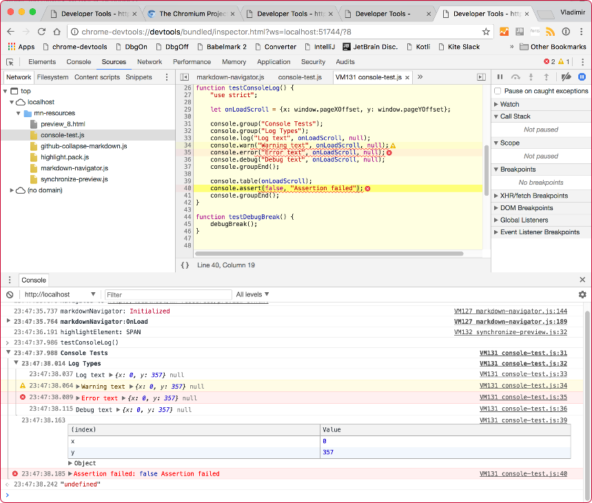

# JavaFX WebView debugger

Based on [mohamnag/javafx_webview_debugger] but rewritten to use [TooTallNate/Java-WebSocket]
instead of org.eclipse.jetty. Much lighter on size and painless to get working, at least in a
JetBrains plugin.

Based on the solution found by Bosko Popovic and well documented by Mohammad Naghavi. Working
with JS code in WebView is now comfortable. Not IDE comfortable, but a whole lot more productive
than trying to figure bugs through log messages.

The limitations for chrome dev tools in JavaFX WebView are significant. The console evaluation
do not work and console log/warn/error/debug from scripts does not make it to the debugger
console.

With hacked code I was able to make dev tools work with WebView and vice versa. There are still
some limitations but now the console in the debugger works as expected, with completions,
evaluations and console logging from scripts. It no longer core dumps and quits right out of
Java, which was happening on a regular basis. JavaFx WebView is no Chromium.

I will be updating this library with the changes but it is a bit of work since my plugin
[Markdown Navigator] is for IntelliJ and has a few JetBrains API specifics in it which will take
some effort to remove for use on any JavaFx WebView project.

Having worked with log based debugging of JavaScript for two years, using Chrome Dev Tools is
like suddenly discovering eyesight. I can now consider adding JavaScript based features which I
avoided like the plague because there are enough differences from a regular browser to make
these "small" jobs into tedious career decisions. 

Here is a screenshot of the dev tools running with JavaFX WebView, showing off the console
logging from scripts:



The rest of this file is mostly a copy of one in mohamnag/javafx_webview_debugger project with
some changes to reflect being able to run multiple debugging sessions on a single server.

Using debugger is done in three main steps:
1. Starting debug server
2. Connecting chrome debugger
3. Clean up

### Starting debug server

If you are using Java up to version 8, to enable debugging on a chosen WebView, you have to add
following code using its `webEngine`:

```java
DevToolsDebuggerServer devToolsDebuggerServer(webEngine.impl_getDebugger(), 51742, 1);
```

`WebEngine.impl_getDebugger()` is an internal API and is subject to change which is happened in
Java 9. So if you are using Java 9, you need to use following code instead to start the debug
server:

```java
Class webEngineClazz = WebEngine.class;

Field debuggerField = webEngineClazz.getDeclaredField("debugger");
debuggerField.setAccessible(true);

Debugger debugger = (Debugger) debuggerField.get(webView.getEngine());
DevToolsDebuggerServer devToolsDebuggerServer.startDebugServer(debugger, 51742, 1);
```

For this to work, you have to pass this parameter to Java compiler: `--add-exports
javafx.web/com.sun.javafx.scene.web=ALL-UNNAMED`.

As examples, this can be done for Maven as follows:

```xml
<plugin>
    <groupId>org.apache.maven.plugins</groupId>
    <artifactId>maven-compiler-plugin</artifactId>
    <version>3.7.0</version>
    <configuration>
        <source>9</source>
        <target>9</target>
        <compilerArgs>
            <arg>--add-exports</arg>
            <arg>javafx.web/com.sun.javafx.scene.web=ALL-UNNAMED</arg>
        </compilerArgs>
    </configuration>
 </plugin>
```

or for IntelliJ under **Additional command line parameters** in **Preferences > Build,
Execution, Deployment > Compiler > Java Compiler**.

### Connecting chrome debugger

Then you only need to open following URL in a chrome browser:

```
chrome-devtools://devtools/bundled/inspector.html?ws=localhost:51742/?1
```

Where 1, 2, 3, ... is the session number you passed to the `DevToolsDebuggerServer` constructor
and 51742 is the port passed to the debug server.

**NOTE**: since the web-socket server is a shared static instance, all sessions will have to use
the same port number.

### Clean up

For a proper shutdown you have to call following when exiting a session or turning off debugging
for it:

```java
devToolsDebuggerServer.stopDebugServer();
```

This will disconnect the JavaFX WebView debugger from its session and this instance of
`DevToolsDebuggerServer` will no longer be usable for debugging. To re-start debugging on the
same session number, create a new instance.

To shut down the web-socket server after all sessions have been stopped call:

```java
DevToolsDebuggerServer.shutdownWebSocketServer();
```

## No Library Installation

Code is too small and will most likely need to be customized for your project. Add the two small
files to your project and modify to your needs. Add [TooTallNate/Java-WebSocket] as a
dependency.

These files were pulled from a project after I got it all working nicely. Removed IntelliJ API
related code and put them here so they can be of use to others.

<!-- 
### Maven

To use maven add this dependency to your pom.xml:

```
<dependency>
  <groupId>org.java-websocket</groupId>
  <artifactId>Java-WebSocket</artifactId>
  <version>1.3.7</version>
</dependency>
```

### Gradle

To use Gradle add the maven central repository to your repositories list :

```
mavenCentral()
```

Then you can just add the latest version to your build.

```
compile "org.java-websocket:Java-WebSocket:1.3.7"
```
 -->

JetBrains IntelliJ project files included if you need to reference them, Library is configured
and downloaded into `lib/`

## Enabling the console

JavaFX WebView does not have a console defined, so console calls inside JavaScript are not
possible by default. In order to enable JavaScript logging inside JavaFX, a bridge class and a
separate listener for JavaScript are required.

#### Bridge class

```java
public class JavaBridge {

    public void log(String text) {
        System.out.println(text);
    }

    public void error(String text) {
        System.err.println(text);
    }
}
```

It is recommended to use `System.out.println` for writing to console and avoid any custom
loggers, as they can cause the entire method to be undefined.

#### Code inside Main class

```java
webEngine.setJavaScriptEnabled(true);

webEngine.getLoadWorker().stateProperty().addListener( new ChangeListener<State>() {
    @Override
    public void changed(ObservableValue ov, State oldState, State newState) {
        if (newState == Worker.State.SUCCEEDED) {
            JSObject window = (JSObject) webEngine.executeScript("window");
            JavaBridge javaBridge = new JavaBridge();
            window.setMember("console", javaBridge); // "console" object is now known to JavaScript
        }
    }
});

```

Note that the name *console* in `window.setMember` can be arbitrary, but it is recommended to
override the console instead because many JavaScript APIs make hidden calls to the console.
Since the console is undefined by default, JavaScript will most likely stop working after that
point.

#### JavaScript example

```javascript
function initializeMap() {

    var moscowLonLat = \[37.618423, 55.751244\];

    map = new ol.Map({
        target: 'map',
        view: new ol.View({
            center: ol.proj.fromLonLat(moscowLonLat),
            zoom: 14
        })
    });
    mapLayer = new ol.layer.Tile({
        source: new ol.source.OSM()
    });

    map.addLayer(mapLayer);

    console.log("Map initialized!"); // This will appear in the JavaFX console
}
```

[Markdown Navigator]: http://vladsch.com/product/markdown-navigator 
[mohamnag/javafx_webview_debugger]: https://github.com/mohamnag/javafx_webview_debugger
[TooTallNate/Java-WebSocket]: https://github.com/TooTallNate/Java-WebSocket

